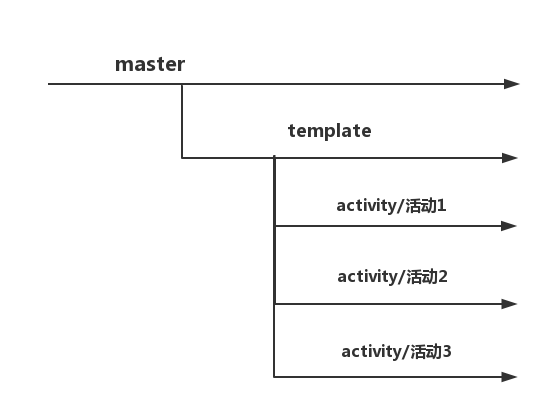

h5活动
======
### 开发流程
说明：当前项目汇总了所有活动页（/src目录下），因为活动将会越来越多，为了方便管理，所以特此梳理开发流程。即每个活动单独的分支管理。



分支命名规范：
```bash
master  // 汇总分支
tempalate   // 公用模板
activity/活动1
activity/活动2
activity/活动3...
```

```js
// 基于模板分支 检出 新活动分支
git fetch

git checkout activity/tempalate

git checkout -b activity/需要新加的活动名称

// 开发即可...
// 调试，在config目录下index.js文件内 将 projectPath = 'activityName/' 目录改为需要调试活动目录即可
// 公用模块以及公用js公用css文件 存放于src/ 同级目录  helper/目录下
```
### 快速使用
```js
// 克隆项目
git clone ssh://git@git.innotechx.com:7999/fac/activity.git
```
```js
// 进入activity项目执行
npm install
```
```js
//
npm run dev

// 项目运行 localhost:9001
```


### 目录结构
```bash
├── /config/         # 项目配置目录
├── /dist/           # 项目输出目录
├── /helper/         # 公用js 公用模板目录
├── /src/            # 项目源码目录
├── package.json     # 项目信息
├── .editorconfig    # 编辑配置
├── .gitignore       # git配置
├── gulpfile.js      # gulp配置
└── webpack.config.js      # webpack配置
```
